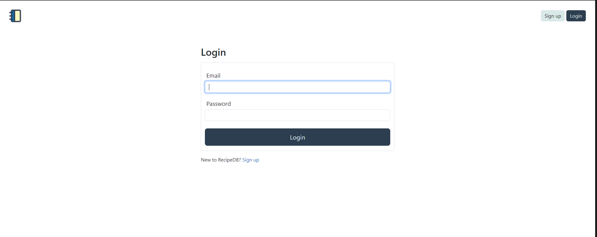
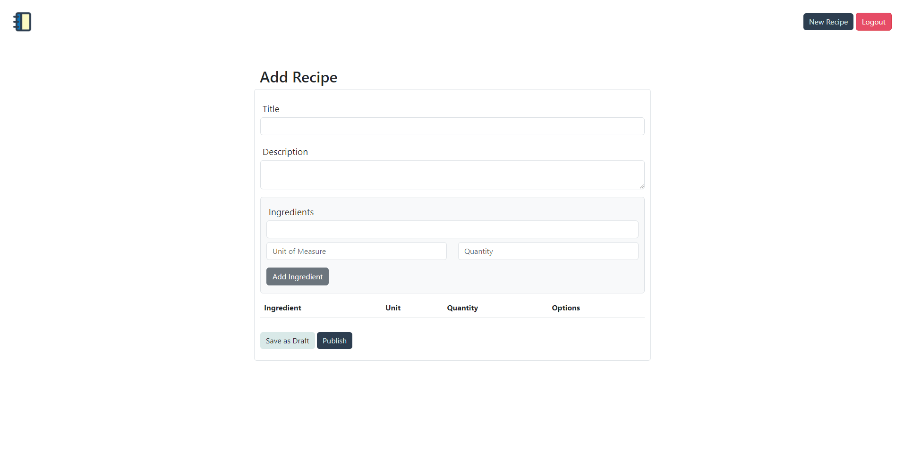

# Recipe.db

## Table of Contents

- [Description](#description)
- [Technologies Used](#technologies-used)
- [Usage](#usage)
- [Deployed Site](#deployed-site)
- [License](#license)

## Description

Recipe.db allows users to create and save their own recipes. When creating a recipe the user can search from our own database with over 10,000 ingredients to search from. The user can then view their saved recipes on their own home page which can only be accessed through creating their own profile.

## Technologies Used

- HTML
- JavaScript
- SQL
- JQuery
- Bootstrap
- Express
- HandleBars.JS

## Usage

A user is brought to a login page with an option to sign-up if the user does not have a profile.

1. The user needs to log in to view the home page of the site.
2. After sign in the user is brought to the home page which is blank for new users
3. The user has a button labeled "New Recipe" which will bring them to the recipe creation page
4. Once in the Recipe creation page the user can add a Title, Description, and ingredients to create their own recipe.
5. The user then can publish their recipe which will save the recipe to a database and the user can view it at a later time

## Deployed Site

[Recipe.db](https://team4-project2-5021452ae8d3.herokuapp.com/)

## License

This project is licensed under [MIT](https://opensource.org/licenses/MIT)
